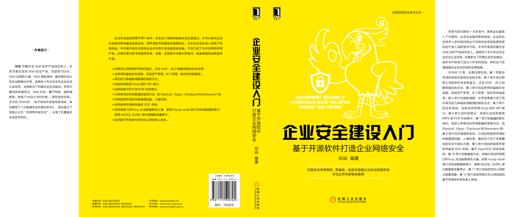

# 《企业安全建设入门:基于开源软件打造企业网络安全》

# 购买链接

# 前言

​	十年前机缘巧合，我进入了安全这个行业，而且在一个公司干到现在。当时公司虽然已经很有名气，但是体量和现在比起来还是很小，安全防护体系还非常脆弱。我的第一个项目就是开发公司的准入系统，当时公司其实已经有了商业准入系统，而且号称是当时Gartner全球排名前几名的，但是在我们具体环境下却没有办法很好的运行，无论是易用性、可管理性甚至是基础的安全性。老外的售后支持也就那样，出现的几次事故也没给出让人信服的解释。最后我们老大，也就是传说中的”我的华为十年”的家俊决定自己开发准入系统。我们两个小伙伴初生牛犊不怕虎，硬是三个月开发出来了第一版，后面我们按照部门、楼层、总部大厦、分公司的顺序在全集团范围推广，这个系统已经服役到现在。也就是从这个项目起，我对开源软件产生了浓厚的兴趣，并尝试在后面的企业安全建设中使用，从SNORT、OSSIM、Kippo再到OSSEC、OpenSOC、Kong这些，我都调研或者使用过。坦诚讲，开源软件存在可管理性差、运营压力大等问题，尤其在专业性要求特别强的领域，比如APT、防火墙和硬件令牌领域，使用商业安全产品比自己研发性价比更高，但是开源软件容易上手、可高度定制、可扩展性强，事实上整个互联网就是基于开源软件发展起来的，使用开源软件在互联网公司做安全也是一个不错的选择。我最近三年主要负责公司对外的商业安全产品，我发现很多模块可以直接使用开源软件，比如Storm、Kafka、ELK、Celery、Hadoop、TensorFlow等，这些开源软件都可以让我们不重复造轮子，把精力放在更核心的安全检测能力和业务逻辑上去。

本书的第一章概述了开源软件和互联网安全的关系。第二章开始介绍互联网公司的防护体系的建立，涉及WAF、抗D和服务器主机安全。第三章介绍业务网的基础安全加固，包括资产管理、补丁管理、操作系统加固等内容。第四章介绍这几年非常火的威胁情报，并且从开发角度介绍了其中常见的几种威胁情报源的获取方式。第五章介绍了业务风控，并详细介绍了如何使用Kong保护API接口。第六章介绍了代码审计，并详细介绍了如何使用RIPS做PHP代码审计。第七章介绍了蜜罐的相关知识，并详细介绍了几种常见的开源蜜罐的使用方法。第八章介绍了态势感知系统，并分别介绍了如何使用开源软件做漏洞扫描、入侵检测，最后还介绍了非常酷炫的安全可视化大屏。第九章介绍了如何使用开源软件建设SOC系统，整个架构都是基于OpenSOC。第十章介绍了数据库安全，并详细介绍了如何使用DBProxy充当数据库防火墙、使用mysql-audit进行主机端数据库审计、使用MySQL Sniffer进行数据库流量审计。第十一章介绍了如何进行办公网的数据防泄露。第十二章和十三章分别介绍了如何进行办公网加固和基于开源软件开发准入系统。

​	本书的每个章节都会介绍国内外对应的一些商业安全产品，国外厂商的列表主要来自业内比较认可的Gartner，国内数据主要来自安全牛的安全全景图，大家可以根据实际情况选择使用商用产品还是基于开源软件DIY，本书并不是介绍商业产品的黄页，而且安全创业公司近几年如雨后春笋，所以有遗漏敬请原谅。

​	我一直有个想法就是用我写书的钱可以开一个烧烤店，虽然目前看开个烧烤摊也勉强，但是我会继续努力，所以本书的演示环境都是基于我假想的在线烧烤网站[www.douwaf.com](http://www.douwaf.com)，该网站基于Nginx +PHP+ MySQL架构，部署了phpMyAdmin和WordPress，整个环境在我购买的云主机上。

​	这里我要感谢我的家人对我的支持，本来工作就很忙，没有太多时间处理家务，写书以后更是花费了我大量的休息时间，我的妻子无条件承担起了全部家务尤其是照料孩子方面的繁杂事务。我很感谢我的女儿，写书这段时间几乎没有时间陪她玩，她也很懂事的自己玩，我也想用这本书作为她的生日礼物。我还要感谢编辑吴怡对我的支持和鼓励，让我可以坚持把这本书写完。最后还要感谢各位业内好友在编写本书上对我的各种形式上的支持，排名不分先后：聂君@安信证券、Killer@腾讯、刘长波@云堤、大路@天际友盟、林榆坚@安赛、廖威@易宝支付、sbilly@360、帮主@运维帮、赵广@运维派、张婉桥@360，最后我还要感谢我的亲密战友哲超、新宇、子奇、月升、张琳、碳基体、刘超、王胄、吴梅以及曾经一起的战友黄颖、冯永校、林健、刘秀英、王龙、阮小伟、程伟、彭正茂、刘永树、李亚强、吴登辉、张雨霏、高磊、邵杨民、王致桥、赵铁壮、张浩、刘铁铮、张东辉、李婷婷、程岩、宋柏林、吴圣、刘袁君、王珉然。

​	本书面向运维和安全行业从业者以及信息安全爱好者、开源技术爱好者。我平时在Freebuf专栏以及i春秋分享企业安全建设以及人工智能相关经验与最新话题，同时也运营我的微信公众号”兜哥带你学安全”，欢迎大家关注并在线交流。

​	

本书使用的代码和数据均在GitHub上发布，对应地址为：

[	https://github.com/duoergun0729/4book](https://github.com/duoergun0729/4book)

​	代码层面任何疑问可以在GitHub上直接反馈。本书的写作时间主要集中在晚上十一点以后，所以大家发现的错别字和表述有误的地方请反馈给我，我会在后面版本尽量改正。
